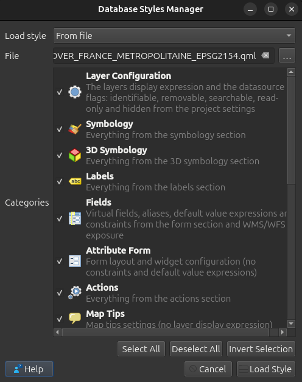

THIBAUDON ARTHUR M1 GEONUM

Les crêts du Pilat

Zone géographique :

Nous devons travailler sur la partie sommitale des Monts du Pilat sur laquelle est identifié un site Natura 2000 d’importance communautaire (SIC), classé au titre de la Directive Habitats et dont le périmètre est publié au Journal officiel de l’Union européenne (JOUE). Ce site est celui des Crêts du Pilat, référencé sous le code FR8201760.

Données disponibles : 

Nous disposons d’ores et déjà de différentes données disponibles sur le territoire du Parc Naturel Régional (PNR) du Pilat :

MNTLimites administrativesOccupation du sol et typologie associéePar ailleurs, sur le site de l’Inventaire National du Patrimoine Naturel (INMP), téléchargez la couche correspondant aux limites des sites classés au titre de la Directive Habitats : périmètres publiés au JOUE (ZSC/SIC).

[https://inpn.mnhn.fr/telechargement/cartes-et-information-geographique/nat/natura](https://inpn.mnhn.fr/telechargement/cartes-et-information-geographique/nat/natura) 

Objectif :

Il s’agit de proposer une carte de l’occupation du sol des Crêts du Pilat, augmenter d’une zone périphérique de 500m. Cette carte devra également porter les zones d’altitude supérieure à 1300m et de pente inférieure à 4°.

Mission :

Proposer deux méthodologies :

Une mettant en œuvre uniquement ArcGis Pro (logiciel propriétaire) ;Une mettant en œuvre uniquement QGIS (logiciel libre).Vous décrirez vos méthodologies ci-dessous, étape par étape, à la façon d’un tutoriel (avec copies d’écran). L’usage de chaque fonction devra être justifié. Pour bilan, vous comparerez les deux logiciels et les résultats obtenus.

Étape 1 vérification des système de projections sur les couches présentes.

La couche CLC 2018 Pilat est sous WGS 84 : donc ont doit uniformisé car la couche SIC télécharger est en lambert 93 . Etant donnée que l’on travaille sur la france il faut tour mettre sous lambert 93. On utilise pour cela la fonction sauvegarder sous.

la couche des limites administratives n’est pas projeter, il y  a une erreur donc on va faire la même manipulation que précédemment c ‘est a dire sauvegarder sous et reprojeter lazcouche en lamber 93 (2154).

Cela a bien marché pour la première couche mais pour la couche des limites adminstratives cela semble ne pas fonctionner de plus l’utilisation de reproject layer ne marche pas. En effet, le problème venait que la couche était en lambert II donc devait avoir 27572 au lieu de 2154 c’est pourquoi cela ne marchait pas précédemment. Nous avons donc opter pour « assign projection » dans QGIS pour faire cela.

Puis nous avons ensuite sauvergarde cette couche en 2154

la deuxième option a été choisie car cela semblait la plus correct des trois pour notre sujet d’étude.

Utilisation de la fonction sauvegarder sous pour mettre a jour le CRS de la couche MNT

création d’un buffer de 500 mètre a partir de la couche des limites adminstrative

puis il faut sauvegarder cette dernière. Il ne faut pas oublier de cocher la case dissolve car c’est l’option qui permet de faire que le buffer soit unie et non en multiple morceaux.

Clip le SIC layer avec le buffer de 500m 

cela vous donnera comme résultat cela : 

sauvegarder encore la couche, ici nous avons choisie comme nom pour la couche SIC_zone_etude car cela est plus pratique pour ce souvenir.

Maintenant pour calculer l’altitude de plus de 1300 il faut utilisé la calculatrice raster de qgis :

Il faut mainentant aussi sélectionner la couche raster que l’on veut prendre dans le input layer puis entrer l’espression suivante : ("mtn_pilat@1" > 1300) * 1

le "[mtn_pilat@1](mailto:mtn_pilat@1)" est le nom de notre couche puis le > 1300 veut dire inférieur a 1300 altitude et le *1 nous permet que le calcule nous ressorte que 2 valeurs . Une valeur 1 et 0.

Vous obtiendrez ce résultat : 

A notez que les valeurs blanches au centre du noir sont les valeurs qui sont a plsu de 1300 d’altitude.

Maintenant nous sauvegardons une nouvelle fois avec le nom mtn_pilat_1300m

maintenant il faut convertir le raster de 1300m en polygone pour cela utilisé la fonction polygonise.

Vous pouvez ensuite changer le style pour avec jenks natural pour obtenir ce résultat : 

A partir du mtn de base utiliser le raster analysis slope pour avoir la couche des pentes dans qgis

Refaire la vetorisation de raster a vector , pour ce tutoriel nous avons utilisé pente_4_degre_pilat

la classificatio utilisé est comme précédent c’est a dire 2 classes avec un natural jenks

maintenant ouvrir les propriétés de la couche CLC lambert 93  pour faire la jointure avec la couche Typo_CLC dans le dossier

[https://www.data.gouv.fr/en/datasets/5d1f6a838b4c4120e1923d4e/#resources-panel](https://www.data.gouv.fr/en/datasets/5d1f6a838b4c4120e1923d4e/" \l "resources-panel) 

télécharger un des fichier puis extraire les fichier pour récupéré le qml.

Cliquer sur le bouton style 

puit cliquer sur charger le style et prenez le style que vous avez en .qml

vous obtiendrez ceci 

Maintenat il suffit faire la symbiologie pour les autres couches comme vous le souhaitez. Puis créé une mise en page pour faire la carte finale. Allez dans “project” > “New print layout” et entrez le nom que vouis souhaiter, vous aurez acces a une page blanche comme cela.

Ensuite aller dans “add item” et ajouter une “map” “legend” . La légende sera extrememement long mais ne vous en faite pas car il faut juste aller dans les paramètre a droite et cliquer sur item properties

Il faut désactiver le auto update car sinon vous ne pourrez pas chanegr les paramètre ou le nom des cocuhes dans la légende

ensutie cocher la case “Only show items inside linked maps”

Maintenant clique sur le fond blanc, faite en sorte de ne pas cliquer sur un objet mais bien sur le fond de base et aller dans items properties et prenez A3 car la légende est bien trop grande pour un simple format A4

ajouter maintenant un “label” puis centrer le texte en horizontale et vertical.

Maintenant cliquer sur le bouton fotn et changer ensuite la taille du titre . Ensuite faite la même chose mais cette fois ci en base de la page pour les source et l’auteur. Ajouter ensutie la ou vous le souhiater dans “add item” une flèche du nord , une échelle. Puis pour terminer renommé le nom des couches correctement en double cliquant sur leur nom et changer les  pour des noms plus correct que CLC ect …

Pour finalisé votre carte il suffit d’aller dans “layout” puis “export as image” et sauvegarder dans le dossier souhaiter.

