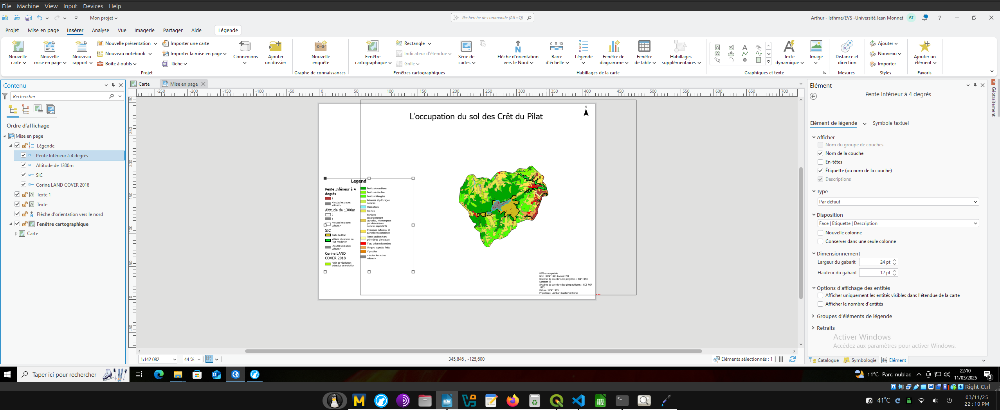

# Guide d'utilisation ArcGIS Pro

1. Ouvrir ArcGIS Pro et choisir le projet avec carte.
   Ensuite, une fois le projet lancé, cliquer sur la couche carte, faire clic droit puis cliquer sur propriétés et utiliser le Lambert 2154 comme système de projection.
   

2. Ensuite, importer les couches pour le projet en prenant les .shp et en les glissant depuis un dossier dans le logiciel ArcGIS Pro.

3. Ouvrez la fenêtre de géotraitement, toutes les fonctions qui vont être citées vous seront trouvées dans cette fenêtre.
   

4. Reprojection des couches car, comme on peut le voir, certaines couches ne sont pas au bon endroit. Donc, aller chercher "Définir une projection", puis choisir notre couche et ensuite cliquer sur la planète et chercher dans l'onglet recherche 27572 et sélectionner Paris Lambert Zone II.
   
   
   

5. Maintenant, il faut reprojeter en mode lot et prendre le système de coordonnées de la carte qui est 2154 ou Lambert 93.
   

6. Pour voir si la transformation a bien été effectuée, vous pouvez faire clic droit sur la couche, propriétés, sources et références spatiales.
   
   

7. Maintenant, pour le modèle numérique de terrain le .asc, refaites "Définir une projection" en Lambert 93 ou 2154 comme ci-dessous.
   

8. Découper les limites administratives par les communes qui se trouvent sur le Crêt du Pilat. Donc aller dans "Mise à jour" puis cliquer sur "Sélectionner" et prendre les communes comme ci-dessous.
   

9. Ensuite, exporter les entités en faisant clic droit, données puis exporter les entités.

10. Retourner dans la fenêtre de géotraitement puis entrer "Zone de tampon".
    Une fois dessus, en entrée mettez limites_admin découpé, unité linéaire prenez Mètres et mettez 500. Fusionner toutes les entités en sortie en une seule entité.
    

11. Découper ensuite les zones SIC et le CLC 2018 par le buffer.
    

12. Utiliser la fonction "Joindre" pour joindre un champ sur le CLC et le typo. Pour faire la symbologie de la couche CLC, faites clic droit symbologie puis cliquer sur le bouton avec trois traits et cliquer sur importer un style et chercher le .lyr dans le dossier couches de ce GitHub
    
    
    
    Pour la couche SIC, choisissez comme valeurs SITE_NAME car cela va vous donner le nom des sites présents et vous pourrez ensuite modifier les couleurs comme vous le souhaitez en faisant un clic droit.
    
    
    Il est recommandé de faire un double clic sur la variable dans la symbologie puis aller ensuite dans propriétés et modifier la taille de la bordure à 2px pour que les SIC se démarquent plus des autres couches comme Corine Land Cover 2018
    
    
13. Nous allons maintenant calculer la pente avec l'outil "Pente" toujours dans géotraitement.
    

14. Pour ne prendre que les pentes de 4 degrés, nous allons utiliser l'outil "Reclassification". 
    

15. Maintenant nous allons faire l'altitude du raster, avec la calculatrice raster, entrer cette formule : Con("Raster" > 1300, 1, 0)
    

16. Polygoniser les rasters avec "Raster vers polygones" les couches de 1300m et 4 degrés pentes. Pourquoi les polygoniser en vectoriel ? Car cela est plus simple pour les traiter avec nos autres couches qui sont aussi sous format vecteur et non raster.
    

17. Découper ensuite ces deux couches avec le buffer de 500m en mode lot comme montré précédemment.

18. Pour la couche de 1300m, aller dans la symbologie en faisant clic droit puis symbologie, puis prenez valeurs uniques et dans le champ 1 mettez gridcode puis choisissez vos couleurs.
    Ensuite, faites exactement la même chose mais avec le raster polygonisé pour les pentes de 4 degrés.
    
    

19. Maintenant pour la mise en page, aller dans "Insérer" puis "Nouvelle mise en page" et prenez le format A3 car notre légende est grande et cela est plus pratique pour organiser notre mise en page de la carte.
    
    

20. Allez dans "Fenêtre cartographique" puis sélectionnez votre Carte.
    

21. Prenez une flèche de direction d'orientation vers le Nord comme montré ci-dessous.
    

22. Dans l'onglet "Texte dynamique", ajouter "Référence spatiale" ; "Nom" ; "Crédit".
    

23. Ajouter une légende pour la carte en allant dans le bouton légende et prenez une légende que vous appréciez.
    

24. Renommez vos couches dans l'onglet carte. Cela va juste renommer les couches et pas changer les noms dans la géodatabase, donc vous pouvez mettre des accents. De plus, décochez en-tête dans chaque objet de la légende que vous avez gardé.
    Vous pouvez ensuite jouer avec la vue de la carte dans la mise en page.
    

25. Ensuite, convertissez la légende en graphique avec le clic droit puis supprimez le titre de la légende "Legend".

26. Maintenant que la légende est en graphique, vous pouvez sélectionner les "sans valeurs" texte et les supprimer si vous le souhaitez.

27. Aller maintenant dans la fenêtre cartographique en double-cliquant puis sélectionner la bordure et mettez-la en transparent.
    

28. Pour exporter la mise en page, aller dans "Partager" ; "Imprimer la mise en page".
    
    

Le résultat : 

